# ThreatLens

## Windows SOC Detection Engineering & Threat Hunting Lab

ThreatLens is a controlled Windows SOC laboratory designed to demonstrate an evidence-driven security operations workflow. The project covers endpoint telemetry collection, detection engineering, alert triage, threat hunting, event correlation, MITRE ATT&CK mapping, false-positive analysis, and security investigation documentation.

The purpose of ThreatLens is not simply to show that an alert was generated. It demonstrates how an analyst moves from telemetry to detection, investigation, validation, and a documented conclusion.

---

## Project Overview

ThreatLens combines a Windows 11 endpoint, Sysmon, Wazuh, an Ubuntu Server, and Microsoft Defender in a controlled laboratory environment.

The project demonstrates:

- Windows endpoint telemetry collection
- Wazuh detection engineering
- Sysmon process, file, and registry analysis
- Security alert triage
- PowerShell investigation
- Account Discovery detection and investigation
- Registry persistence detection and contextual analysis
- Event correlation and timeline reconstruction
- Hypothesis-driven threat hunting
- MITRE ATT&CK mapping
- False-positive analysis
- Evidence-based security documentation

Only validated or clearly observed activity is presented as project evidence. Controlled simulations and endpoint validation tests are explicitly identified as such.

---

## SOC Investigation Workflow

```text
Windows Endpoint Activity
          |
          v
     Sysmon Telemetry
          |
          v
      Wazuh Agent
          |
          v
 Wazuh Manager / Rules
          |
          v
       Security Alert
          |
          v
      Analyst Triage
          |
          v
     Raw Event Review
          |
          v
 Process / File / Registry Correlation
          |
          v
   MITRE ATT&CK Context
          |
          v
False-Positive / Context Analysis
          |
          v
    Analyst Conclusion
          |
          v
      Documentation
```

The central methodology is:

**Detect -> Investigate -> Correlate -> Validate -> Document**

---

## Objectives

The main objectives of ThreatLens are to:

- Build a Windows-focused SOC monitoring environment.
- Collect detailed endpoint telemetry using Sysmon.
- Forward endpoint events through the Wazuh Agent.
- Process and detect security-relevant behavior using Wazuh.
- Engineer and validate focused custom detections.
- Investigate encoded PowerShell execution.
- Detect and investigate Account Discovery activity.
- Detect and analyze Registry Run Key activity.
- Correlate process and file telemetry.
- Perform hypothesis-driven threat hunting.
- Map observed behavior to MITRE ATT&CK.
- Analyze legitimate activity and false-positive conditions.
- Document evidence, reasoning, limitations, and conclusions.

---

## Lab Architecture

The monitored endpoint is a Windows 11 system running the Wazuh Agent, Sysmon, and Microsoft Defender. The Wazuh monitoring stack is hosted on an Ubuntu Server.

```text
+-------------------------------+
|          Windows 11           |
|                               |
|  +---------+  +-------------+ |
|  | Sysmon  |  | Wazuh Agent | |
|  +----+----+  +------+------| |
|       |              |        |
|       +-------+------+        |
|               |               |
|               v               |
|        Endpoint Telemetry     |
+---------------+---------------+
                |
                v
+-------------------------------+
|         Ubuntu Server         |
|                               |
|  Wazuh Manager                |
|  Wazuh Indexer                |
|  Wazuh Dashboard              |
+---------------+---------------+
                |
                v
         SOC Investigation
```

The architecture documentation and diagrams are available in:

- [Architecture Documentation](architecture/README.md)
- [ThreatLens Architecture Diagram](architecture/threatlens-architecture.png)
- [Network Topology](architecture/network-topology.png)

---

## Technology Stack

| Technology | Purpose |
|---|---|
| Wazuh | Centralized security monitoring, detection, alerting, and investigation |
| Wazuh Agent | Endpoint telemetry collection and forwarding |
| Wazuh Manager | Event processing and rule evaluation |
| Wazuh Indexer | Security event storage and search |
| Wazuh Dashboard | Monitoring, threat hunting, and investigation |
| Sysmon | Detailed Windows process, file, and registry telemetry |
| Windows 11 | Monitored endpoint |
| Microsoft Defender | Endpoint protection validation |
| Ubuntu Server | Wazuh server environment |
| MITRE ATT&CK | Standardized adversary-behavior mapping |

---

## Detection Coverage

ThreatLens focuses on three primary detection engineering cases and one endpoint security validation case.

| Detection | Rule / Source | Telemetry | MITRE ATT&CK | Status |
|---|---|---|---|---|
| Account Discovery | Rule 100100 | Sysmon Event ID 1 | T1087 | Validated |
| Encoded PowerShell | Rule 92057 | Sysmon Event ID 1 | T1059.001 | Validated in controlled lab |
| Registry Run Key Activity | Rule 100102 | Sysmon Event ID 13 | T1547.001 | Detected and context-analyzed |
| EICAR Endpoint Validation | Microsoft Defender | Defender Protection History | — | Validation test |

A high-severity alert is treated as an investigation priority, not automatic proof of compromise.

For the complete detection matrix, see:

[Detection Matrix](detections/detection-matrix.md)

---

## Detection Engineering

ThreatLens separates detection logic, alert evidence, and investigation evidence.

### Account Discovery

The Account Discovery detection identifies `net.exe` / `net1.exe` activity associated with Windows account enumeration.

MITRE ATT&CK: T1087 — Account Discovery

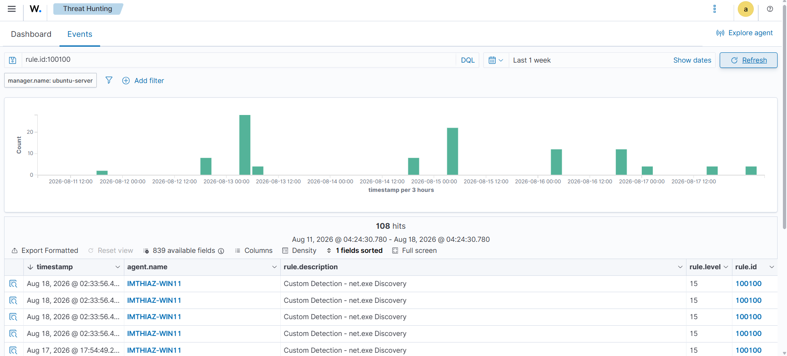

Custom Wazuh Rule 100100.

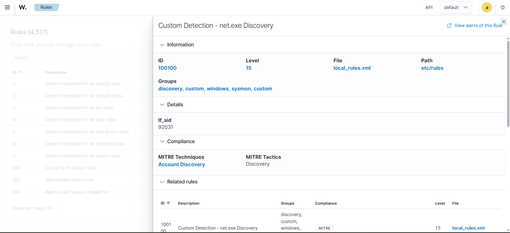

Wazuh alert generated from the observed Account Discovery behavior.

[View Account Discovery Detection](detections/account-discovery/README.md)

### Encoded PowerShell

Wazuh Rule 92057 identifies PowerShell execution containing an encoded command.

MITRE ATT&CK: T1059.001 — PowerShell

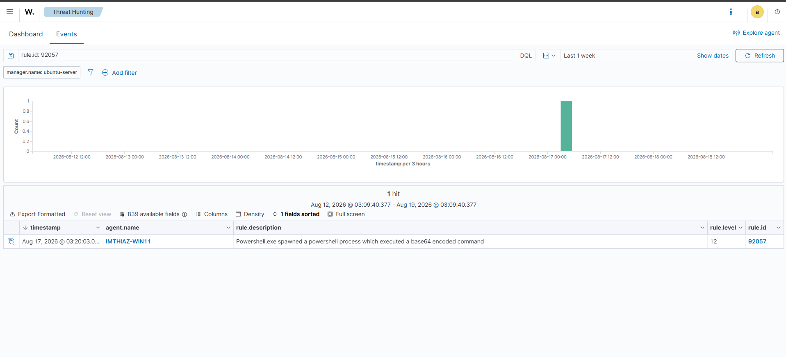

Wazuh detection for encoded PowerShell execution.

[View PowerShell Detection](detections/powershell/README.md)

### Registry Persistence

Custom Rule 100102 identifies Registry Run Key activity relevant to persistence analysis.

MITRE ATT&CK: T1547.001 — Registry Run Keys / Startup Folder

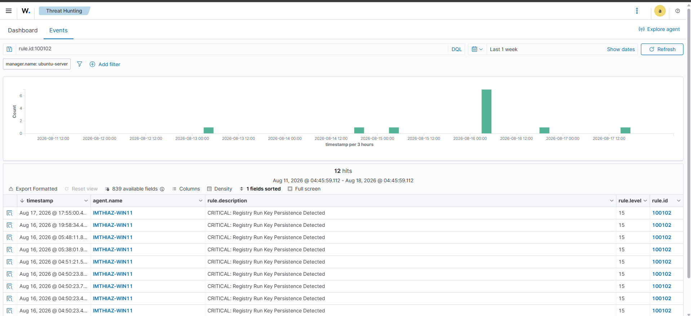

Wazuh detection for Registry Run Key activity.

[View Registry Persistence Detection](detections/registry-persistence/README.md)

---

## Featured Investigation: IR-001 Encoded PowerShell

The PowerShell investigation demonstrates how a SOC analyst moves from a detection alert into the underlying endpoint telemetry.

Rule 92057 identified PowerShell execution containing an encoded command.

The Sysmon process event provided investigation context including:

- PowerShell executable
- Command-line parameters
- User context
- Process ID
- Parent Process ID
- Parent image
- Integrity level
- File hashes

A related file-creation event was then correlated using process and timestamp context.

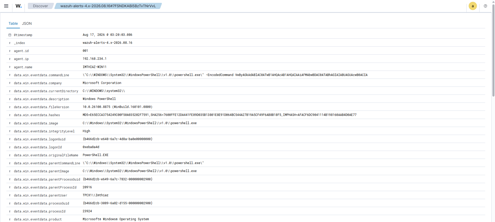

Underlying Sysmon PowerShell process telemetry.

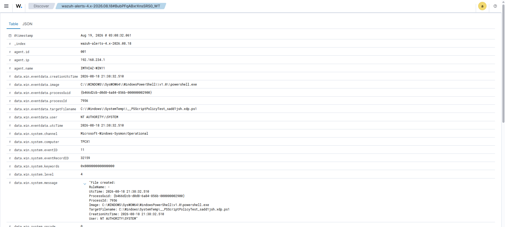

Related file-creation telemetry associated with the PowerShell execution.

### Analyst Assessment

This activity was intentionally generated as an authorized laboratory simulation.

The evidence demonstrates:

**Detection -> Raw Event Analysis -> Process Correlation -> Timeline Reconstruction**

It should not be presented as evidence of a real-world compromise.

[Read the complete IR-001 investigation](investigations/IR-001-encoded-powershell/README.md)

---

## Featured Investigation: IR-002 Account Discovery

Custom Rule 100100 detected Windows account-discovery behavior involving `net.exe` / `net1.exe`.

The investigation pivots from the Wazuh alert into the underlying Sysmon process event.

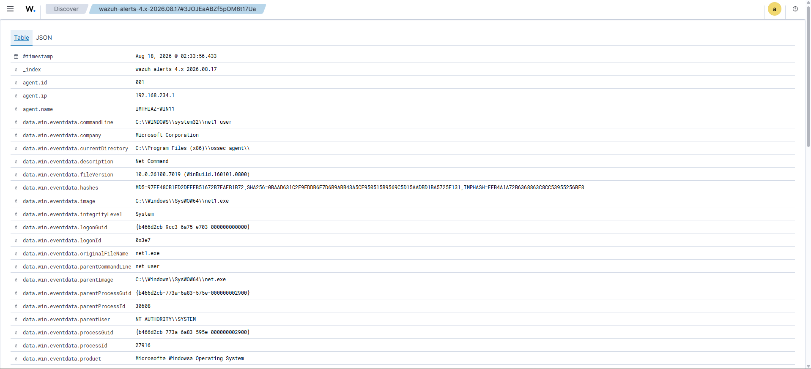

Underlying endpoint telemetry for the Account Discovery activity.

The event provides useful context such as:

- Executable
- Command line
- Parent process
- Process identifiers
- User context
- Integrity level
- Hash information

### Analyst Assessment

The Account Discovery behavior is validated.

However, the event alone does not establish malicious intent. In a real investigation, the analyst would continue by examining:

- Initiating process
- User and logon context
- Other discovery commands
- Authentication activity
- Privilege escalation indicators
- Lateral movement indicators
- Surrounding endpoint alerts

[Read the complete IR-002 investigation](investigations/IR-002-account-discovery/README.md)

---

## Registry Persistence and False-Positive Analysis

Registry Run Keys are relevant to persistence because applications can automatically start through these locations.

However, legitimate software can also modify the same registry locations.

ThreatLens therefore follows this investigation process:

```text
Registry Persistence Alert
          |
          v
Inspect Registry Event
          |
          v
Identify Process
          |
          v
Inspect Application Context
          |
          v
Validate Behavior
          |
          v
Benign / Legitimate Context
```

The observed registry activity was associated with Microsoft Edge context.

This demonstrates an important SOC principle:

> Detection of a technique is not automatically detection of an attacker.

The detection remains useful because the same persistence mechanism can be abused by malicious software, while the observed instance requires contextual classification.

[Read the False-Positive Analysis](documentation/false-positive-analysis.md)

---

## Endpoint Security Validation: EICAR

ThreatLens includes an endpoint protection validation using the EICAR antivirus test artifact.

EICAR is designed to safely trigger antivirus products without using real malware.

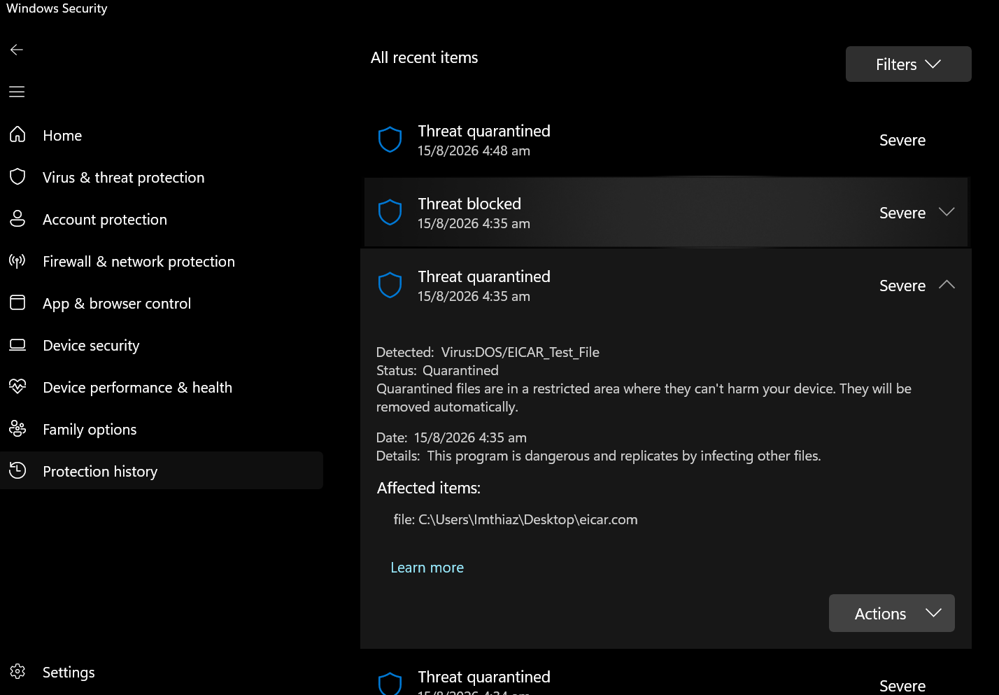

Microsoft Defender detection and quarantine of the EICAR test artifact.

### Result

Endpoint protection control successfully validated.

This is a security-control validation test, not a malware infection or real incident.

[Read the complete endpoint validation case](investigations/IR-003-endpoint-malware-validation/README.md)

---

## Threat Hunting

Threat hunting in ThreatLens is hypothesis-driven.

Rather than waiting only for an alert, the analyst begins with a behavior worth investigating and searches endpoint telemetry for supporting or contradicting evidence.

```text
Hypothesis
    |
    v
Search Telemetry
    |
    v
Filter / Pivot
    |
    v
Inspect Raw Events
    |
    v
Correlate
    |
    v
Assess
    |
    v
Document
```

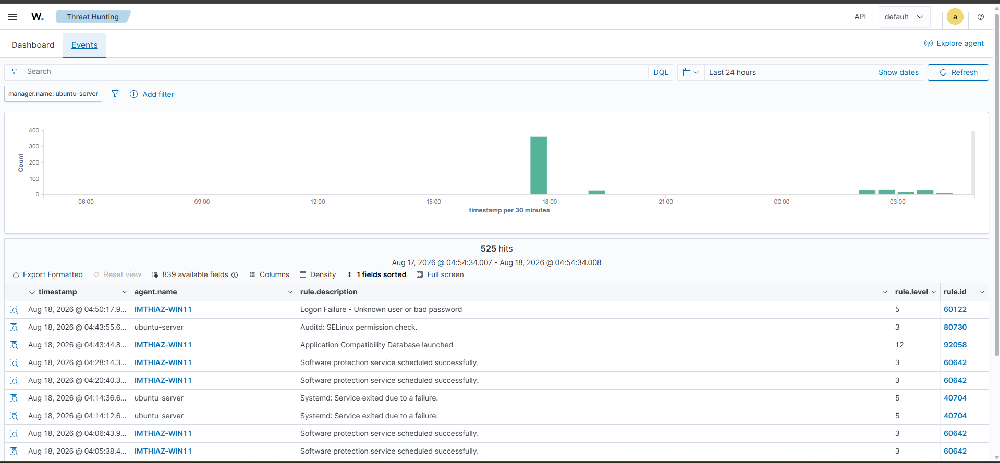

Threat hunting and event investigation view.

[Explore the Threat Hunting Methodology](threat-hunting/README.md)

---

## MITRE ATT&CK Mapping

MITRE ATT&CK is used to describe observed behaviors using a standardized framework.

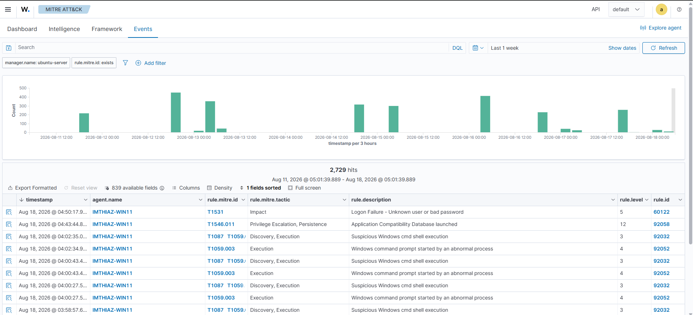

MITRE ATT&CK event and technique view.

| Technique | Behavior Observed | ThreatLens Example |
|---|---|---|
| T1059.001 — PowerShell | Encoded PowerShell execution | Rule 92057 |
| T1087 — Account Discovery | `net user` account enumeration | Rule 100100 |
| T1547.001 — Registry Run Keys / Startup Folder | Run Key modification | Rule 100102 |

ATT&CK mapping provides behavioral context. It does not independently prove malicious intent.

[View the ATT&CK Technique Mapping](mitre-attack/technique-mapping.md)

---

## SOC Dashboard

The Wazuh Dashboard provides the analyst-facing view of security telemetry, alert activity, and investigation data.

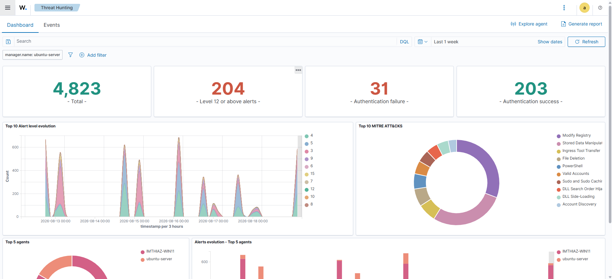

ThreatLens final security overview.

[View Dashboard Documentation](dashboards/README.md)

---

## Analyst Investigation Workflow

ThreatLens follows a repeatable investigation process:

```text
1. Confirm endpoint and telemetry health
                |
                v
2. Identify suspicious or security-relevant behavior
                |
                v
3. Detect the behavior
                |
                v
4. Validate the alert
                |
                v
5. Pivot into raw event telemetry
                |
                v
6. Examine process, command line, user, and parent process
                |
                v
7. Correlate file, registry, and authentication activity
                |
                v
8. Reconstruct the timeline
                |
                v
9. Map behavior to MITRE ATT&CK
                |
                v
10. Check legitimate application context
                |
                v
11. Determine confidence and analyst verdict
                |
                v
12. Document evidence and recommendations
```

This workflow represents the core SOC methodology demonstrated throughout the project.

---

## Repository Structure

The repository is organized so that each major area of the SOC workflow has its own documentation and evidence.

```text
ThreatLens/
│
├── README.md                          ← Project overview, architecture, links to everything
├── LICENSE
├── .gitignore
│
├── architecture/
│   ├── README.md                      ← Explains the diagrams below
│   ├── threatlens-architecture.png
│   └── network-topology.png
│
├── detections/
│   ├── detection-matrix.md            ← One-table summary of all 3 detections
│   │
│   ├── account-discovery/
│   │   ├── README.md                  ← Rule 100100 · net.exe discovery
│   │   ├── rule-100100.xml
│   │   └── evidence/
│   │       ├── rule-100100.png
│   │       └── account-discovery-alert.png
│   │
│   ├── powershell/
│   │   ├── README.md                  ← Rule 92057 · encoded PowerShell
│   │   └── evidence/
│   │       └── encoded-powershell-alert.png
│   │
│   └── registry-persistence/
│       ├── README.md                  ← Rule 100102 · Run key persistence
│       ├── rule-100102.xml
│       └── evidence/
│           └── registry-persistence-alert.png
│
├── investigations/
│   ├── IR-001-encoded-powershell/     ← Flagship case: alert → correlation → timeline → MITRE
│   │   ├── README.md
│   │   ├── timeline.md
│   │   ├── evidence.md
│   │   └── evidence/
│   │       ├── powershell-event-details.png
│   │       └── correlated-file-creation.png
│   │
│   ├── IR-002-account-discovery/
│   │   ├── README.md
│   │   ├── timeline.md
│   │   ├── evidence.md
│   │   └── evidence/
│   │       └── account-discovery-event.png
│   │
│   └── IR-003-endpoint-malware-validation/   ← EICAR/Defender, clearly labeled "not a real incident"
│       ├── README.md
│       ├── timeline.md
│       ├── evidence.md
│       └── evidence/
│           └── defender-eicar-detection.png
│
├── threat-hunting/
│   ├── README.md
│   ├── hunting-methodology.md         ← Hypothesis → search → pivot → validate
│   └── hypotheses.md
│
├── mitre-attack/
│   ├── attack-matrix.md               ← All techniques used, in one table
│   └── technique-mapping.md           ← Detailed behavior → technique → tactic reasoning
│
├── dashboards/
│   ├── README.md                      ← Explains dashboard = environment view, not proof of incident
│   └── evidence/
│       └── final-security-overview.png
│
├── documentation/
│   ├── setup.md                       ← Environment build steps
│   ├── detection-engineering.md       ← How rules were designed/tested
│   ├── incident-response.md           ← The 8-step investigation methodology
│   ├── false-positive-analysis.md     ← Per-detection FP reasoning
│   ├── lessons-learned.md
│   ├── limitations.md                 ← What was parked and why
│   └── ThreatLens-Full-Project-Report.pdf
│
└── assets/
    ├── threatlens-banner.png
    └── threatlens-logo.png
```

---

## Documentation

### Detection Engineering

- [Detection Matrix](detections/detection-matrix.md)
- [Account Discovery Detection](detections/account-discovery/README.md)
- [PowerShell Detection](detections/powershell/README.md)
- [Registry Persistence Detection](detections/registry-persistence/README.md)

### Investigations

- [IR-001 — Encoded PowerShell](investigations/IR-001-encoded-powershell/README.md)
- [IR-002 — Account Discovery](investigations/IR-002-account-discovery/README.md)
- [IR-003 — Endpoint Malware Validation](investigations/IR-003-endpoint-malware-validation/README.md)

### Threat Hunting

- [Threat Hunting Overview](threat-hunting/README.md)
- [Hunting Methodology](threat-hunting/hunting-methodology.md)
- [Hunting Hypotheses](threat-hunting/hypotheses.md)

### MITRE ATT&CK

- [ATT&CK Matrix](mitre-attack/attack-matrix.md)
- [Technique Mapping](mitre-attack/technique-mapping.md)

### Project Documentation

- [Lab Setup](documentation/setup.md)
- [Detection Engineering](documentation/detection-engineering.md)
- [Incident Response Methodology](documentation/incident-response.md)
- [False-Positive Analysis](documentation/false-positive-analysis.md)
- [Lessons Learned](documentation/lessons-learned.md)
- [Limitations](documentation/limitations.md)
- [Full Project Report](documentation/ThreatLens-Full-Project-Report.pdf)

---

## Key Findings

ThreatLens demonstrated that:

- Windows endpoint telemetry can be centralized and investigated through Wazuh.
- Sysmon provides valuable process, file, registry, and command-line context.
- Custom Wazuh rules can turn specific endpoint behaviors into actionable investigation leads.
- Account Discovery behavior was successfully detected and validated.
- Encoded PowerShell execution was successfully detected in a controlled simulation.
- Process identifiers and timestamps can be used to correlate related endpoint events.
- Registry persistence detections require contextual analysis because legitimate software can trigger similar behavior.
- Microsoft Defender successfully detected the EICAR test artifact.
- MITRE ATT&CK provides a consistent framework for describing observed security behaviors.
- False-positive analysis is an essential part of professional detection engineering.

---

## What ThreatLens Demonstrates

### SOC and Blue Team

- Alert triage
- Endpoint monitoring
- Event investigation
- Threat hunting
- Incident documentation
- False-positive analysis

### Detection Engineering

- Wazuh rules
- Sysmon telemetry
- Custom detection logic
- Detection validation
- MITRE ATT&CK mapping

### Windows Security

- PowerShell analysis
- Process lineage
- Account Discovery
- Registry persistence
- File activity
- Endpoint protection validation

### Investigation

- Raw event analysis
- Process correlation
- Timeline reconstruction
- Evidence preservation
- Analyst verdicts

---

## Project Limitations

ThreatLens is a controlled laboratory environment and has limitations:

- Small endpoint population.
- No production-scale identity infrastructure.
- No enterprise cloud telemetry.
- Controlled security simulations rather than a real-world victim intrusion.
- Detection effectiveness depends on configured telemetry and rules.
- EICAR is a harmless antivirus test artifact, not real malware.
- MITRE ATT&CK mappings provide behavioral context and do not independently prove malicious intent.

Experiments that did not produce reliable evidence are intentionally excluded from the validated detection set and documented where appropriate in the project limitations.

---

## Portfolio Integrity

ThreatLens prioritizes evidence-backed conclusions over impressive-looking alerts.

The project distinguishes between:

```text
Observed behavior
      !=
Malicious intent
      !=
Confirmed compromise
```

A professional SOC analyst must investigate context before assigning a final classification.

This principle is applied throughout the ThreatLens documentation.

---

## Disclaimer

ThreatLens was developed for authorized educational and defensive-security purposes in a controlled laboratory environment.

All simulated security activity was performed within an environment owned or authorized for testing.

This project must not be interpreted as evidence of unauthorized access, real-world victim compromise, or malicious activity outside the laboratory.

---

## Final Note

ThreatLens is not simply a collection of Wazuh alerts.

It demonstrates the complete security-analysis cycle:

**Telemetry -> Detection -> Investigation -> Correlation -> Hunting -> ATT&CK -> Validation -> Documentation**
